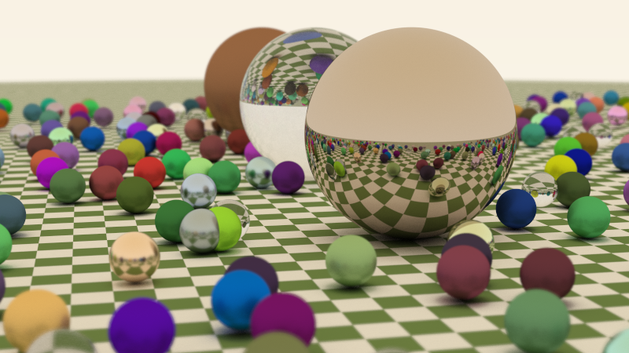

# Basic Raytracer - C++ 11
- - -
In this first release the focus was on following and understanding the bibliographical
sources

The code was implemented following the C++11 standard in a more structured and OOP friendly manner than presented in
the books, with added multithread support.

a few artistic (and some performance guided) decisions were taken, such as boundary weighted
random reflections (instead of uniformly random) to have stronger shadows and lower number
of samples per ray.

the output is a file "render.png" like the following

- - -
Sources

 * Peter Shirley - Raytracing Open Source Books

* Scratchapixel - Computer graphics lessons for math explanations

* nothings/stb_image_write.h